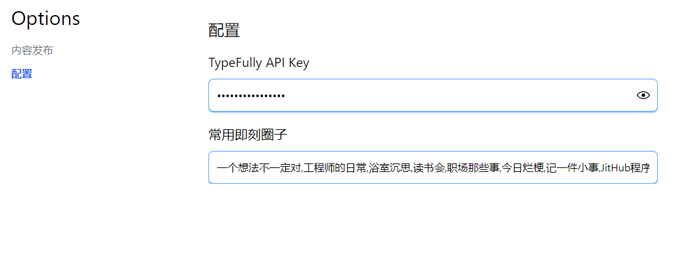

我是半庄 ([LBan](https://twitter.com/LBan2049)) ，我在实践 Build In Public，本仓库是我公开做的一个 Side Project，我会在 twitter、即刻、微博上公开我开发过程中遇到的问题和思考，欢迎关注、讨论。


---

## 介绍

NoteSync 是一个浏览器插件，提供的功能是自动同步发布 twitter、即刻和微博。首先是我自己有这个需求，当有些思考想要公开分享的时候，希望能同时发布在这几个平台，一方面是和更多的人交流，另一方面也希望能认识更多的人，积累一些影响力，为后面独立产品宣传提供帮助。而且我关注的一些博主，发现他们也会在这几个平台发布相同的内容，所以我觉得这功能是有需求的。

Chrome 应用商店地址：[Note Sync](https://chrome.google.com/webstore/detail/note-sync%E9%9A%8F%E7%AC%94%E5%90%8C%E6%AD%A5/dlndiobcgnbmbeekdekcpjglkpnfcnnl?hl=en&authuser=0)

### 实现方式

选择浏览器插件来实现的原因，是因为这样更简单，用户在自己平时用的浏览器上，各平台应该是已经登录的，登录问题问题就不需要解决了。

微博和即刻的实现方式是，通过JS打开发布页，操作DOM，模拟用户操作发布。这种方式不需要分析平台接口，只需要在输入框输入文本，点击发布按钮，就完成操作了，足够简单。

但是twitter的发布页面比较复杂，而且有字数限制，模拟操作不太实现了，我平时会使用第三方工具 [Typefully](https://typefully.com/) 提供发布 twitter 的API，可以免费使用，这次开发就使用了 Typefully的API，需要在插件中配置 API Key，[参考文档](https://help.typefully.com/api)。

## 使用指南

目前只有同步发布这个功能，做两个入口：

1. 点击插件图标打开的弹窗，输入内容，点击发布。入口更便捷，但是发布后因为会打开新tab，弹窗会自动关闭。

2. 在选项页面，内容发布菜单，操作和弹窗中相同。在选项页中操作，避免了每次弹窗关闭的问题，适合有多条内容连续发布的场景。

发布twitter需要在选项页中配置 Typefully API Key，[获取文档](https://help.typefully.com/api)。

目前没有发布上架，试用可参考下方开发指南。

## 界面




## 开发

安装依赖(推荐使用pnpm)：

```bash
pnpm i
```

运行开发环境：

```bash
pnpm dev
# or
npm run dev
```

打开您的浏览器，开启开发者模式，加载已解压的文件夹。例如，如果您正在为Chrome浏览器开发，使用清单v3，请使用：`build/chrome-mv3-dev`。

## 发布

运行命令:

```bash
pnpm build
# or
npm run build
```